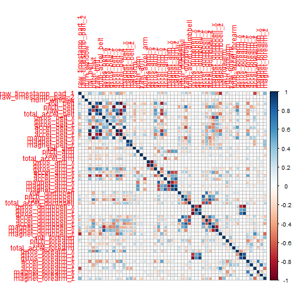
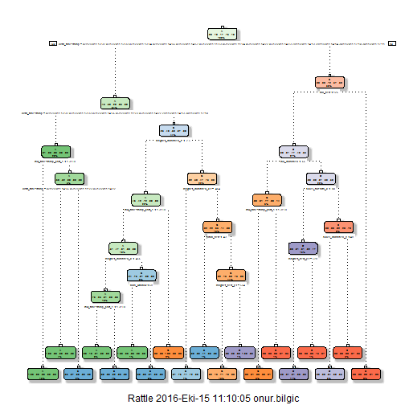

  ---
title: "Weight Lifting Exercises Prediction"
author: "Onur BÝLGÝÇ"
date: "29 September 2016"
output: html_document
---
## Weight Lifting Exercises Dataset

This human activity recognition research has traditionally focused on discriminating between different activities, i.e. to predict "which" activity was performed at a specific point in time (like with the Daily Living Activities dataset above). The approach we propose for the Weight Lifting Exercises dataset is to investigate "how (well)" an activity was performed by the wearer. The "how (well)" investigation has only received little attention so far, even though it potentially provides useful information for a large variety of applications,such as sports training.

In this work (see the paper) we first define quality of execution and investigate three aspects that pertain to qualitative activity recognition: the problem of specifying correct execution, the automatic and robust detection of execution mistakes, and how to provide feedback on the quality of execution to the user. We tried out an on-body sensing approach (dataset here), but also an "ambient sensing approach" (by using Microsoft Kinect - dataset still unavailable)

Six young health participants were asked to perform one set of 10 repetitions of the Unilateral Dumbbell Biceps Curl in five different fashions: exactly according to the specification (Class A), throwing the elbows to the front (Class B), lifting the dumbbell only halfway (Class C), lowering the dumbbell only halfway (Class D) and throwing the hips to the front (Class E).


We will use caret package for machine learning applications. Also there are some packages are needed which you can see the below code chunk 


```r
library(e1071)
library(corrplot)
library(caret)
library(kernlab)
library(ggplot2)
library(rpart)
library(rattle)
```

# Getting Data 

You can see the data links below. They were taken from course assignment page. 


```r
foldername1<-"pml-training.csv"
if (!file.exists(foldername1)){
  file_url <- "https://d396qusza40orc.cloudfront.net/predmachlearn/pml-training.csv"
  download.file( file_url, foldername1)
} 
traindata<-read.csv(foldername1,header = TRUE,na.strings = c("NA",""))
foldername2<-"pml-testing.csv"
if (!file.exists(foldername2)){
  file_url <- "https://d396qusza40orc.cloudfront.net/predmachlearn/pml-testing.csv"
  download.file( file_url, foldername2)
} 
testdata<-read.csv(foldername2,header = TRUE,na.strings = c("NA",""))

features<-as.data.frame(names(traindata))
names(features)<-"Features"
```


## Cleaning Data  

Below loop shows that 100 features of data have 19216 quantity of observation are missing value. It is easy and benefical way to ignore these features. 


```r
c<-data.frame(V1=character(), 
                     V2=character(),
                     stringsAsFactors=FALSE)
for(i in 1:length(names(traindata))){
    c[i,2]<-sum(is.na(traindata[,i]))}

c$V1<-names(traindata)
names(c)<-c("feature","Train NA-Counts")
c[1:20,]
```

```
##                 feature Train NA-Counts
## 1                     X               0
## 2             user_name               0
## 3  raw_timestamp_part_1               0
## 4  raw_timestamp_part_2               0
## 5        cvtd_timestamp               0
## 6            new_window               0
## 7            num_window               0
## 8             roll_belt               0
## 9            pitch_belt               0
## 10             yaw_belt               0
## 11     total_accel_belt               0
## 12   kurtosis_roll_belt           19216
## 13  kurtosis_picth_belt           19216
## 14    kurtosis_yaw_belt           19216
## 15   skewness_roll_belt           19216
## 16 skewness_roll_belt.1           19216
## 17    skewness_yaw_belt           19216
## 18        max_roll_belt           19216
## 19       max_picth_belt           19216
## 20         max_yaw_belt           19216
```

Number of non-NA Features

```r
sum(c[,2]==0)
```

```
## [1] 60
```

Number of NA Features

```r
sum(c[,2]==19216)
```

```
## [1] 100
```

The new train and  new test data are arranged for the rest of the prediction.

```r
d<-c[c$`Train NA-Counts`==0,]
e<-d[-c(1,2),1]
f<-d[-c(1,2,60),1]
newtrain<-traindata[,e]
newtestdata<-testdata[,f]
```


## Plotting Data

After the plot we can assume that most of features in our new train dataset aren't correlated each other. 


```r
m<-cbind(newtrain[1:2],newtrain[5:57])
z<-cor(m)
corrplot(z,method = "square")
```



## Modelling 

The training data for cross validation is arranged  0.75 from the main train data. The caret package can supply easy ways to split data to training and testing. 


```r
inTrain<-createDataPartition(y=newtrain$classe,p=.75,list = FALSE)
  training<- newtrain[inTrain,]
  testing<- newtrain[-inTrain,]
dim(training)  
```

```
## [1] 14718    58
```

```r
dim(testing)
```

```
## [1] 4904   58
```

###Decision Tree

The first model is decision tree. The model splits the data to levels by using decision 	criterias. In below model gives us %64 accuracy . It is not enough for trustable predictions.   


```r
set.seed(1112)
modelfit0<-train(classe~.,method="rpart",data=training)
pred0<-predict(modelfit0,testing)
confusionMatrix(pred0,testing$classe)
```

```
## Confusion Matrix and Statistics
## 
##           Reference
## Prediction    A    B    C    D    E
##          A 1054  101    1    0    0
##          B  237  633  183  374  298
##          C  102  215  671  430  194
##          D    0    0    0    0    0
##          E    2    0    0    0  409
## 
## Overall Statistics
##                                           
##                Accuracy : 0.5642          
##                  95% CI : (0.5502, 0.5782)
##     No Information Rate : 0.2845          
##     P-Value [Acc > NIR] : < 2.2e-16       
##                                           
##                   Kappa : 0.4499          
##  Mcnemar's Test P-Value : NA              
## 
## Statistics by Class:
## 
##                      Class: A Class: B Class: C Class: D Class: E
## Sensitivity            0.7556   0.6670   0.7848   0.0000  0.45394
## Specificity            0.9709   0.7239   0.7676   1.0000  0.99950
## Pos Pred Value         0.9118   0.3670   0.4163      NaN  0.99513
## Neg Pred Value         0.9090   0.9006   0.9441   0.8361  0.89050
## Prevalence             0.2845   0.1935   0.1743   0.1639  0.18373
## Detection Rate         0.2149   0.1291   0.1368   0.0000  0.08340
## Detection Prevalence   0.2357   0.3518   0.3287   0.0000  0.08381
## Balanced Accuracy      0.8632   0.6955   0.7762   0.5000  0.72672
```

```r
fit<-rpart(classe~.,data=training)
fancyRpartPlot(fit)
```




###Random forest

Secondly Random forest is implemented on the data.It is an alternative decision tree but it is more efficient. The number tree is 10 . It is very low but it will be enough and fast. After that the confusion matrix shows us that random forest gets %99 accuracy in testing data. It is highly trustable prediction for this expriment. 


```r
set.seed(123)
modelfit1<-train(classe~.,data = training,method="rf",ntree=10)
pred1<-predict(modelfit1,testing)
confusionMatrix(pred1,testing$classe)
```

```
## Confusion Matrix and Statistics
## 
##           Reference
## Prediction    A    B    C    D    E
##          A 1395    1    0    0    0
##          B    0  948    1    0    0
##          C    0    0  853    1    0
##          D    0    0    1  803    2
##          E    0    0    0    0  899
## 
## Overall Statistics
##                                           
##                Accuracy : 0.9988          
##                  95% CI : (0.9973, 0.9996)
##     No Information Rate : 0.2845          
##     P-Value [Acc > NIR] : < 2.2e-16       
##                                           
##                   Kappa : 0.9985          
##  Mcnemar's Test P-Value : NA              
## 
## Statistics by Class:
## 
##                      Class: A Class: B Class: C Class: D Class: E
## Sensitivity            1.0000   0.9989   0.9977   0.9988   0.9978
## Specificity            0.9997   0.9997   0.9998   0.9993   1.0000
## Pos Pred Value         0.9993   0.9989   0.9988   0.9963   1.0000
## Neg Pred Value         1.0000   0.9997   0.9995   0.9998   0.9995
## Prevalence             0.2845   0.1935   0.1743   0.1639   0.1837
## Detection Rate         0.2845   0.1933   0.1739   0.1637   0.1833
## Detection Prevalence   0.2847   0.1935   0.1741   0.1644   0.1833
## Balanced Accuracy      0.9999   0.9993   0.9987   0.9990   0.9989
```


### Support Vector Machine

The last algorithm is Support Vector Machine. It is good way to classify outcome levels. It works that one line split the value p and p'.After that 
ýt selects the prediction levels. At the end the accuracy is %95 for this model. 


```r
set.seed(111112)
modelfit2<-svm(classe~.,data = training)
pred2<-predict(modelfit2,testing)
confusionMatrix(pred2,testing$classe)
```

```
## Confusion Matrix and Statistics
## 
##           Reference
## Prediction    A    B    C    D    E
##          A 1389   65    0    0    0
##          B    2  865   31    0    0
##          C    4   19  819   51    1
##          D    0    0    5  752   34
##          E    0    0    0    1  866
## 
## Overall Statistics
##                                           
##                Accuracy : 0.9566          
##                  95% CI : (0.9505, 0.9621)
##     No Information Rate : 0.2845          
##     P-Value [Acc > NIR] : < 2.2e-16       
##                                           
##                   Kappa : 0.945           
##  Mcnemar's Test P-Value : NA              
## 
## Statistics by Class:
## 
##                      Class: A Class: B Class: C Class: D Class: E
## Sensitivity            0.9957   0.9115   0.9579   0.9353   0.9612
## Specificity            0.9815   0.9917   0.9815   0.9905   0.9998
## Pos Pred Value         0.9553   0.9633   0.9161   0.9507   0.9988
## Neg Pred Value         0.9983   0.9790   0.9910   0.9874   0.9913
## Prevalence             0.2845   0.1935   0.1743   0.1639   0.1837
## Detection Rate         0.2832   0.1764   0.1670   0.1533   0.1766
## Detection Prevalence   0.2965   0.1831   0.1823   0.1613   0.1768
## Balanced Accuracy      0.9886   0.9516   0.9697   0.9629   0.9805
```

## Conclusion

After the three model we understand that Random Forest works better than others. In below chunk it is used for test data . You can see the 20 prediction of this data. 


```r
pred3<-predict(modelfit1,newtestdata)
pred3
```

```
##  [1] B A B A A E D B A A B C B A E E A B B B
## Levels: A B C D E
```

